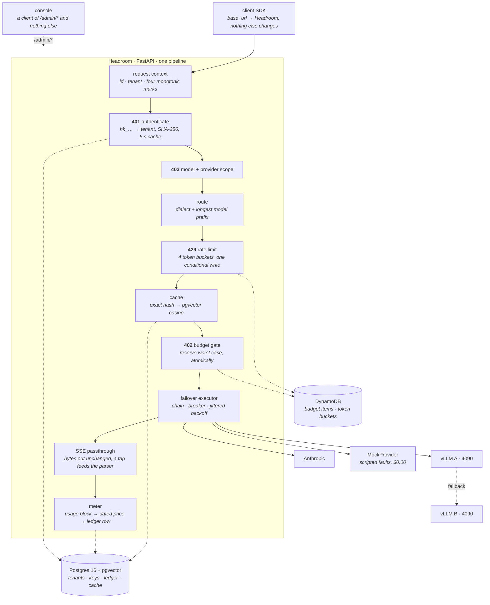

# Headroom

[](LICENSE)

**An LLM gateway and control plane.** Headroom sits between applications and model
providers — Anthropic-dialect and OpenAI-dialect, cloud APIs and self-hosted vLLM —
and every request flows through it. Because everything flows through it, it does the
things every AI-native company needs and either builds badly or buys: virtual keys
and per-tenant budgets that actually enforce under concurrency, token-bucket rate
limits on atomic primitives, exact + semantic response caching, provider failover
with jittered backoff, and per-tenant/per-route/per-model cost attribution with a
live dashboard.

> *Headroom* (audio): the space between your peak level and clipping. A gateway
> whose whole job is keeping tenants under their limits.

---

## The headline

**Everyone ships semantic caching. Here is how often it silently lies, measured.**

On 130 questions carrying an exact answer key, at the industry-default similarity
threshold of **0.90**, a semantic cache answers **98 of 130 never-before-seen questions
from a neighbouring entry — and 92 of those answers are provably wrong.** On the same
corpus at the same threshold it serves **389 of 390 genuine paraphrases** from cache,
**382 of them correctly**. Both halves are the finding: a control surface that looks
excellent on the traffic you tested it with and poisons the traffic you did not is not a
safe control surface.

**No threshold fixes it.** The closest *wrong* answer scores **0.999539** — two questions
differing in one period token. The furthest *correct* one scores **0.889850**. The bands
overlap, so one cosine number cannot separate them, and **τ₀ — the recommended safe
threshold, defined by a rule fixed before the curve was drawn — does not exist** anywhere
in 0.70 → 0.99.

And the gateway that measured it is close to free to stand in front of a model:

| Claim | Measured | Artifact |
|---|---|---|
| Answer quality through the extra hop, 133 questions | **93.7 vs 93.3 direct**, Δ **+0.4** against a pre-registered bound of 3.0 — **WITHIN NOISE** | [`h2_analysis.json`](experiments/results/h2_analysis.json) |
| Passthrough overhead, 462 live suite requests | **p50 0.0612 ms** (p95 0.1176, p99 0.1644) | [`h2_analysis.json`](experiments/results/h2_analysis.json) |
| The same column on **ECS Fargate**, behind an ALB | **0.0249 ms** | [`p9-aws/06-live-ledger-row.json`](docs/evidence/p9-aws/06-live-ledger-row.json) |
| The same column on **EKS**, behind an NLB | **0.0175 ms** | [`p10-eks/day1-live-ledger-row.json`](docs/evidence/p10-eks/day1-live-ledger-row.json) |
| Two independent meters over one $7.54 run | **$7.541253** vs **$7.540398** — and the entire $0.000855 residual is one identified request | [`h2_analysis.json`](experiments/results/h2_analysis.json) |
| A rolling `helm upgrade` under load, on EKS | **8342 requests, 0 dropped** — after two runs that read **1** and **2** | [`p10-eks/09c…json`](docs/evidence/p10-eks/09c-load-loop-run3-drain.json) |
| A GPU killed mid-run, from `us-east-1` to a desk | **92 requests, 92 ok, 0 dropped** | [`p10-eks/15-failover-loop.json`](docs/evidence/p10-eks/15-failover-loop.json) |
| Live API spend, entire project | **≈ $8.10** against a pre-committed **$20** cap | [`REPORT.md`](experiments/results/REPORT.md) |

**Every number above is recomputed from a committed artifact by
[`tests/test_docs.py`](tests/test_docs.py) on every pull request.** A claim in this README
that no longer follows from its evidence turns the suite red. That is the whole discipline:
a doc claim without an artifact behind it does not ship.

---

## Quickstart: one command

A cold clone reaches a working, *checked* demo in one command. No API key, no network, no
GPU, **$0.00**.

```bash
git clone https://github.com/sergioavilax/headroom && cd headroom
make demo
```

`make demo` generates a root admin token into the gitignored `.env`, brings up Postgres +
pgvector, DynamoDB Local, the gateway and the console, applies the migrations, mints a
tenant and a virtual key through the public admin API — and then **asserts** every claim
this README makes about the local stack, printing each one with its expected value beside
it and exiting non-zero if any of them is not true of your clone:

```
1. A request is priced to the picodollar, at the rates it was billed at.
  ok    the meter read the usage block, not the text: 11 in / 7 out
  ok    11 x $0.2500000000/MTok + 7 x $1.2500000000/MTok = $0.000011500000 (priced)
2. The same question twice is one upstream call, and the saving has a column.
  ok    the second is cache_hit_exact, served from hr_9f9fbcec… — the request that produced it
3. The interesting part of a cache is what it refuses.
  ok    a stream cut mid-answer ends in a terminal error event, with no message_stop
  ok    and the cache still holds 1 entries: neither was stored
4. A broken primary is invisible to the caller; a broken stream never is.
  ok    the primary 529s and the fallback answers: 200, hops=1 from=mock
  ok    and a fault *after* the first byte is never spliced: 1 message_start, not two
5. A rate limit that cannot be raced, and says when it heals.
  ok    3 requests/minute, 5 fired: [200, 200, 200, 429, 429]
6. A budget gate that reads committed spend, before a provider is called.
  ok    402 billing_error / budget_exceeded — not 429, because a budget does not heal
7. And the console renders exactly these numbers.

22/22 checks passed
```

Needs Docker, GNU make and [uv](https://docs.astral.sh/uv/). Host ports: gateway `8080`,
console `3001`, Postgres `5433`, DynamoDB Local `8001` — chosen to coexist with whatever is
already on 5432/8000/3000, all overridable in `.env`. Then:

```bash
make seed    # four tenants and ~74 requests, so every console view has something real in it
make test    # the keyless suite; `live` tests are excluded by default
make lint typecheck
```

---

## How a request flows

One pipeline, two dialects. The order of the gates is a decision with a test behind it
([H-039](docs/DECISIONS.md), [H-046](docs/DECISIONS.md)), not an accident of who wrote what
first.



The rate limiter runs **before** the budget gate so a rate-refused request never takes a
hold it must hand back. The cache sits **after** the limiter — a tenant that could serve
unlimited traffic by repeating itself would have a denial of service for the asking — and
**before** the budget gate, taking no reservation at all, so a tenant over its cap still
gets its cached answers. A budget bounds spend, and a hit does not spend.

---

## The finding: how often a semantic cache silently lies

> everyone ships semantic caching; almost nobody measures how often it silently returns the
> wrong answer, because measuring that requires a large question set with exact ground
> truth. Backline is one. — [BUILD_PLAN §P8.H1](BUILD_PLAN.md)

[Backline](https://github.com/sergioavilax/backline) is this project's sibling: a
133-question royalty-accounting benchmark where every question has an **exact expected
answer**. That answer key is what makes this measurable. Seed a cache with 130 canonical
questions, embed 520 probes, record the full similarity matrix once, and replay the
gateway's own admission decision offline across the whole threshold range — 59 grid points,
zero marginal API cost.

Two probe families, both pre-registered, neither substituted for the other:

| | family | probes | is there a right answer to find? |
|---|---|---:|---|
| **A** | **paraphrase** of a seeded question | 390 | **yes** — its own question is in the cache |
| **B** | **novel question**, probed against a cache holding the other 129 | 130 | **no** — every hit is a wrong-source hit by construction |

**A ∪ B, in the space the gateway actually embeds:**

| threshold | probes | hits | correct | **silently wrong** | modelled saving |
|---:|---:|---:|---:|---:|---:|
| 0.70 | 520 | 520 | 383 | **130** | $30.84 |
| 0.85 | 520 | 507 | 383 | **118** | $30.07 |
| **0.90** ← the shipped default | 520 | 487 | 382 | **99** | $28.88 |
| 0.95 | 520 | 392 | 353 | **39** | $23.25 |
| 0.99 | 520 | 54 | 36 | **18** | $3.20 |

At the shipped default, **one hit in five is a wrong answer served with confidence**.
Every point of both curves, in both embedding spaces, is in
[`h1_curve.json`](experiments/results/h1_curve.json).

`τ₀ = None`. **Why**, in two numbers rather than a mystery:

```
highest similarity at which the cache serves a provably WRONG answer   0.999539
lowest  similarity at which the cache serves a          CORRECT answer 0.889850
                                                        → the bands overlap
```

The 0.999539 pair is two reconciliation questions differing in **one period token**:

```
asked   Scan every statement for period 2026-02 for reporting anomalies — …
served  Scan every statement for period 2026-04 for reporting anomalies — …

the caller receives   5 findings, on line ids 80023526, 89000001-4
the true answer is    2 findings, on line ids 100013815, 109000001
```

**The embedding is not broken; it is right.** Those two prompts really are 99.95% the same
text. The failure is in using that measurement as an *admission decision*, because the
seven characters it correctly treats as negligible are the entire answer. That is not a
property of this benchmark — it is a property of **every application that templates its
prompts**, which is most of them.

**What a reader should take from it.** Not "never use a semantic cache". The honest reading
is narrower and more useful: **a cosine threshold is the wrong control surface for a
workload whose questions differ by an entity or a period.** What would work is not a higher
bar but a different mechanism — requiring extracted entities and periods to match exactly
before a semantic hit is allowed, which is a *filter*, not a threshold. Headroom does not
ship that today, and this measurement is why it is the first thing its cache should grow.

Full adjudication, per-category breakdown, the boilerplate sensitivity check, and the curve
as committed JSON and SVG: [`experiments/results/REPORT.md`](experiments/results/REPORT.md).

---

## What the gateway costs

Backline's full 133-question suite was re-run **through** Headroom by pointing
`ANTHROPIC_BASE_URL` at the gateway and changing nothing else — zero changes to Backline,
its scoring included. Third treatment of the same suite: local, AWS, and now one extra hop.

| | overall | Δ vs gateway |
|---|---:|---:|
| **gateway (this run)** | **93.7** | — |
| direct-local — the pre-registered comparator | 93.3 | **+0.4** |
| AWS Fargate | 92.5 | +1.2 |
| committed sweep | 91.6 | +2.1 |

**Δ +0.4 against a pre-registered bound of 3.0 — WITHIN NOISE**, 13% of the allowance.
Stated before the result and unchanged by it: there is **no same-day paired control**, so
between-day drift sits inside that residual. H2 supports a statement about a **bound**, not
an effect size.

**Overhead is three numbers, because one would be misleading.**

| measurement | value | what it is |
|---|---:|---|
| `passthrough_overhead_ms` p50, 462 live requests | **0.0612 ms** | first upstream byte → first byte out. The metric the plan pre-registered against `< 50 ms`, and **passing it by three orders of magnitude proves little** — it is reported first because it is what was promised |
| the same column, one live request on **ECS Fargate** behind an ALB | **0.0249 ms** | [`p9-aws/06-live-ledger-row.json`](docs/evidence/p9-aws/06-live-ledger-row.json) |
| the same column, one live request on **EKS** behind an NLB | **0.0175 ms** | [`p10-eks/day1-live-ledger-row.json`](docs/evidence/p10-eks/day1-live-ledger-row.json) |
| both of those rows price themselves | 15 in / 7 out at $1.00/$5.00 per MTok = $0.000050 | exact, not rounded, with the rates copied onto the row |
| **admission cost**, 2,000 keyless requests through the full pipeline | **p50 0.207 ms** in memory · **1.441 ms** with DynamoDB behind the limiter and the gate | the honest number: auth, routing, buckets, cache lookup, budget reservation. The two atomic conditional writes that make the budget gate and the rate limiter unraceable cost **1.233 ms**, priced here for the first time |

Against this run's own measured **12,185 ms** p50 per question, the gateway's admission path
is **0.012% of a request**. That is the answer to *"shouldn't a gateway be written in Go"* —
measured, not dodged.

**Two independent meters, one stream of traffic.** Headroom meters from the usage block it
observes in the stream; Backline meters from the SDK's own. Over 462 rows:

```
Headroom's ledger   $7.541253
Backline's own      $7.540398
difference          $0.000855   ← inside the pre-registered $0.01
```

The entire residual is **one identified request**: `hr_e171f6024fc64772a66840fda6aab05a`,
the pre-flight tool-block smoke on the same tenant five minutes before the suite, which
Headroom metered and Backline never issued. Set it aside and **the two meters agree to
twelve decimal places on 461 requests.**

Backline's own strict regression gate **failed** on this run — and so did the direct-local
reference run whose 93.3 is the comparator, on *disjoint* categories, against a composite
baseline no single run in its history has ever matched. Both are published verbatim, along
with the one T2 violation unique to the gateway run, named in full so a reader can disagree
using the same evidence. [The whole adjudication is in
REPORT.md](experiments/results/REPORT.md#backlines-strict-regression-gate-failed--and-so-did-the-reference-run).

---

## A working demo, with no key and no network

`make demo` does all of this for you and checks it. By hand, so you can see the surface:

Every `/v1/*` request needs a virtual key, and keys are minted through the admin API,
which needs a root token. Set one first — in the gitignored `.env`, never in git:

```bash
echo "HEADROOM_ADMIN_TOKEN=$(python -c 'import secrets;print(secrets.token_urlsafe(32))')" >> .env
make up
```

Then create a tenant, mint it a key, and use it. The `mock-` models are served by the
built-in MockProvider, so this costs nothing and talks to nobody:

```bash
export ADMIN="Authorization: Bearer $(grep HEADROOM_ADMIN_TOKEN .env | cut -d= -f2)"

curl -sS -X POST localhost:8080/admin/tenants -H "$ADMIN" \
     -H 'content-type: application/json' -d '{"name":"acme"}'
# {"id":"<tenant-id>", "name":"acme", "active":true, ...}

curl -sS -X POST localhost:8080/admin/keys -H "$ADMIN" \
     -H 'content-type: application/json' \
     -d '{"tenant_id":"<tenant-id>","name":"laptop","allowed_models":["mock-*"]}'
# {"id":"<key-id>", "key_prefix":"hk_XXXXXXXX", ..., "key":"hk_…"}   <- the ONLY time

curl -sS -X POST localhost:8080/v1/messages -H 'Authorization: Bearer hk_…' \
     -H 'content-type: application/json' \
     -d '{"model":"mock-model-1","max_tokens":32,"messages":[{"role":"user","content":"hi"}]}'
```

**The plaintext key is returned exactly once, by `POST /admin/keys`, and cannot be
recovered afterwards.** Only its SHA-256 and an 11-character display prefix are stored;
lose it and mint a new one. Revocation is `DELETE /admin/keys/{id}` — the key stops
working on the very next request in that gateway process, and within **5 seconds**
(`AUTH_CACHE_TTL_S`) in any other. Nothing is ever deleted: keys are revoked and tenants
deactivated, because the cost ledger points at their ids forever.

`401` means the gateway does not know who you are (no key, malformed, unknown, revoked,
inactive tenant). `403` means it knows exactly who you are and the key is not scoped to
that model or provider. The reasoning for all of it is in
[docs/DECISIONS.md](docs/DECISIONS.md) H-017 … H-022.

## The console

`make up` also brings up the operator dashboard on **http://localhost:3001**. To see it
with something in it:

```bash
make seed              # four tenants and ~74 requests, through the public API only
```

Sign in with the same `HEADROOM_ADMIN_TOKEN` the gateway was started with. Eight views —
Overview, **Live traffic**, Requests, Tenants & keys, Limits & budgets, Cache, Providers,
History — and every number in them is one the gateway's own `/admin/*` API published. The
console has no database URL and no way to get one: a figure it needs and the API does not
publish gets published on the API, with tests, rather than queried behind its back
([H-054](docs/DECISIONS.md)).

Three things are worth knowing before it is running:

- **It is handed no secret at all**, not even by reference. The root token is typed into
  the sign-in screen and exchanged for an `httpOnly`, `SameSite=Strict` session cookie held
  by the console's own server; it never crosses into client code, so there is nothing in a
  bundle, a task definition, or a `docker inspect` to leak ([H-055](docs/DECISIONS.md)).
- **It polls** — 2 s on the live view, 5 s on the overview, 15 s on the control-plane
  tables — and a hidden tab does not poll at all ([H-056](docs/DECISIONS.md)).
- **`make seed` writes no SQL.** It configures through `/admin/*` and generates traffic
  through `/v1/*` against the MockProvider, so every figure on screen is one the gateway
  really computed, and it costs $0.00.

The one flourish: a tenant's budget is a **channel strip**. Settled spend and live
reservations stack from the bottom like signal, the hairline across the top is the cap, and
the space between them is headroom. That is BUILD_PLAN §0.2 rule 5 drawn — the gate
compares *committed* spend, landed **plus** reserved, and a dashboard rendering only the
landed bar would be D-019 with a nicer font.

More in [`ui/README.md`](ui/README.md).

## The cost ledger

Every request that authenticated and named a model becomes one row in `usage_ledger`,
priced at the rates that were in effect **on the day it arrived**:

```bash
curl -sS -H "$ADMIN" localhost:8080/admin/usage           # the ledger, newest first
curl -sS -H "$ADMIN" localhost:8080/admin/usage/totals    # spend per tenant
curl -sS -H "$ADMIN" 'localhost:8080/admin/usage/totals?by_model=true'
curl -sS -H "$ADMIN" localhost:8080/admin/usage/hr_…      # one request, by its id
```

Filters: `tenant_id`, `key_id`, `model`, `provider`, `outcome`, `since`, `until`,
`limit`, `offset`. The surface is read-only; every other verb is a 405.

Four things about it are deliberate, and each has an entry in
[docs/DECISIONS.md](docs/DECISIONS.md):

**Prices are a dated history, not a number** (H-023). `config/models.yaml` gives each
model a list of `(effective_from, usd_per_mtok_in, usd_per_mtok_out)` rows, and the
committed file already contains a real boundary: Anthropic published Claude Sonnet 5 at
an introductory $2/$10 per MTok through **2026-08-31**, $3/$15 after — so the identical
request costs different money on either side of that midnight. Rates are *quoted
strings*; an unquoted `3.00` is a YAML float and the loader refuses it by name.

**A row keeps the price it was billed at** (H-024). The rates are copied into the row,
so editing the price file — or a vendor publishing new rates — can never re-bill a
request that already happened. This is Backline's D-017 scar turned into a column
layout.

**The meter reads the usage block; it never counts the text** (H-025, and Phase 1's live
smoke). A reasoning model can answer in eleven visible characters and bill sixty-three
tokens, fifty-seven of them chain-of-thought that appears nowhere in the content stream.
`output_tokens` is reasoning-inclusive, always, from the provider's own report.

**`NULL` and `0` are different facts**, and `cost_status` says which — `priced`,
`partial`, `unpriced_model`, `usage_unknown`, `not_billable`. An upstream 429 provably
cost nothing (`0`). A stream cut mid-answer cost *something nobody can know* (`NULL`).
A meter that wrote `0.00` for both would look identical and be wrong.

Two consequences worth knowing before you read a total:

- **Anonymous 401s are not in the ledger.** They have no tenant to attribute, and the
  structured log line already records them. A tenant's row count is not their request
  count.
- **OpenAI-dialect *streamed* requests are only meterable if the caller asked for
  usage.** Send `"stream_options": {"include_usage": true}` and the counts arrive;
  without it the row is honestly `usage_unknown`, because Headroom will not rewrite a
  caller's request body to close the gap (H-028). `unpriced_requests` on every total
  says how many rows a sum could not include.

Money is `Decimal` from the YAML file through the arithmetic to `NUMERIC(24, 12)` and
back out **as a string** — JSON has one numeric type and it is a double.

## Budgets that hold under concurrency

A tenant is uncapped until you give it a cap. Then every request is admitted — or
refused — by **one atomic DynamoDB conditional write, before it can reach a provider**:

```bash
curl -sS -X PUT localhost:8080/admin/budgets/$TENANT -H "$ADMIN" \
     -H 'content-type: application/json' -d '{"usd": "25.00", "window": "monthly"}'

curl -sS -H "$ADMIN" localhost:8080/admin/budgets/$TENANT
# {"usd":"25.000000000000","spent":"0.000011500000","reserved":"0.000000000000",
#  "remaining":"24.999988500000","committed":"0.000011500000","window_id":"2026-08", …}
```

`window` is `monthly` (calendar month, UTC) or `total` (lifetime). `usd` is a **quoted
string** — a JSON number is a double, and the API refuses one by name.

**The design, in one sentence.** Admission reserves the request's *worst case* — its
`max_tokens` ceiling plus the size of the body it sent, at the model's dated price — and
the check and the deduction are the same operation:

```
ConditionExpression: remaining_picos >= :estimate
UpdateExpression:    SET remaining_picos = remaining_picos - :estimate, …
```

Completion settles the hold to the actual cost, handing the difference back. Nothing is
cached, ever: not the balance, not the cap, not whether a tenant has one.

That shape is Backline's **D-019** scar as a product feature. There, a gate checked
spend, then added spend, in two operations; under concurrency every request passed the
check before any had recorded anything, and the budget was blown.
`tests/test_budget_stampede.py` fires 64 concurrent requests at a cap sized for 5, on
DynamoDB Local, and asserts settled spend never exceeds it — then reruns the identical
stampede against two deliberately broken gates to prove the test can catch what it
claims to:

```
ATOMIC GATE (shipped)                        SABOTAGED (D-019: check, then write)
  served (200)           5                     served (200)           64
  refused (402)          59                    refused (402)          0
  spend / budget         1.00x                 spend / budget         12.80x

SABOTAGED (atomic, but reads LANDED spend)   ← BUILD_PLAN's own named sabotage
  served (200)           38                     everything the first one got wrong is
  spend / budget         7.60x                  right here, and it is still 7.6× over
```

**Atomicity is necessary and it is not sufficient.** All three runs are asserted, so the
two sabotages are permanent.

Three more things worth knowing:

- **A refusal is `402`**, in the caller's own dialect (Anthropic `billing_error`, OpenAI
  `insufficient_quota`), with `headroom.reason: budget_exceeded` and the tenant's own
  figures in the message. Not `429` — that means *slow down*, every SDK retries it, and
  a budget refusal does not heal inside its window.
- **A crashed process cannot strand budget.** Holds expire after 15 minutes and are
  released — not charged — and the sweep runs on the *refusal* path, so a dead process's
  hold can never be the reason a live request is turned away.
- **The budget and the invoice deliberately disagree on one class of request** (H-031).
  When the cost is genuinely unknown — a timeout, a cut stream — the ledger writes
  `NULL` because it states facts, and the budget keeps the reservation because it states
  bounds. Both figures are on the same row.

Argued in [docs/DECISIONS.md](docs/DECISIONS.md) H-030 … H-034.

## Rate limits that cannot be raced either

The same discipline, one primitive over. Limits are **requests per minute and tokens per
minute, per key and per tenant**, and a scope is unlimited until you say otherwise:

```bash
curl -sS -X PUT localhost:8080/admin/limits/tenant/$TENANT -H "$ADMIN" \
     -H 'content-type: application/json' -d '{"requests_per_min": 60, "tokens_per_min": 100000}'

curl -sS -H "$ADMIN" localhost:8080/admin/limits/tenant/$TENANT
# {"requests_per_min":60,"tokens_per_min":100000,
#  "buckets":[{"dimension":"requests","available":57,"reset_after_s":3, …}, …]}
```

`PUT` **replaces**: an omitted dimension is *unlimited*, not *unchanged*. `DELETE` clears
the limits and empties the buckets — the incident-response route.

**A token bucket cannot be stored as a count of tokens.** The obvious item — `tokens`
plus `refilled_at` — has to be read, refilled in application code, checked, and written
back, which is D-019 again in a different noun. So the bucket is stored as **a time**:
one number, the moment it will next be full. Admission becomes a bare comparison, and
therefore one conditional write:

```
ConditionExpression: tat <= :now + capacity_ns - :charge_ns
UpdateExpression:    SET tat = tat + :charge_ns
```

`tests/test_rate_limit_hammer.py` fires 64 concurrent requests at a bucket holding 5, on
DynamoDB Local, and asserts exactly 5 are served — then reruns it against **three**
broken limiters. The first over-admits and proves the hammer works. The other two *pass
the hammer* and fail elsewhere, which is the more useful lesson:

```
BOUNDARY BURST (limit 5/min, two seconds spanning a minute)
  shipped token bucket   5          a fixed-window counter is perfectly atomic
  fixed-window counter   10         and admits twice the limit, forever, at every boundary

BURST AFTER AN HOUR IDLE (limit 5/min)
  shipped token bucket   5          a GCRA without its clamp is perfectly atomic and
  unclamped GCRA         300        admits an hour's worth of credit after an hour of quiet
```

Three more things worth knowing:

- **A refusal is `429` with `retry-after`** — the case that status was invented for, and
  the exact opposite of the budget's `402`: a rate limit heals with time and the amount
  of time is known, so the honest thing is to say so.
- **Headroom's 429 is distinguishable from a provider's**, which Phase 6's failover logic
  needs: `x-headroom-error-source: gateway`, `x-headroom-ratelimit-scope`, and
  `headroom.reason: rate_limited`. The header is the load-bearing marker, because the
  whole `x-headroom-*` namespace is stripped from every upstream response — an upstream
  cannot claim to be the gateway.
- **Nothing settles.** A budget is a stock and a rate limit is a flow: an over-charge
  against a bucket is erased by the bucket's own refill, so there is no compensating
  release anywhere on the path — and therefore no operation whose absence breaks an
  invariant.

Argued in [docs/DECISIONS.md](docs/DECISIONS.md) H-035 … H-039.

## The cache that is allowed to say no

Two layers behind one interface. **Exact**: a canonical hash of the request. **Semantic**:
`bge-small-en-v1.5` on CPU, pgvector cosine search over the tenant's own namespace, hit
above a per-tenant threshold. Caching is **off for every tenant until somebody switches it
on** — the column default, not a convention:

```bash
curl -sS -X PUT localhost:8080/admin/cache/$TENANT -H "$ADMIN" \
     -H 'content-type: application/json' \
     -d '{"mode": "semantic", "similarity_threshold": 0.9, "ttl_s": 86400}'

curl -sS -H "$ADMIN" localhost:8080/admin/cache/$TENANT
# {"mode":"semantic","similarity_threshold":0.9,"effective_ttl_s":86400,
#  "embedding_model":"BAAI/bge-small-en-v1.5","entries":12,"semantic_entries":12, …}
```

A hit carries its own provenance, so an answer can always be traced to the question it was
actually produced for:

```
x-headroom-cache: cache_hit_semantic
x-headroom-cache-source: hr_9f2c…          <- the request that populated the entry
x-headroom-cache-similarity: 0.98012
x-headroom-cache-age: 41
```

**The interesting part of a cache is what it refuses.** Invariant 6 exists because
Backline's D-021 served content that did not belong to the question asked, and one bad
write here is served forever. So:

- **A truncated answer is never stored.** `stop_reason: max_tokens` / `finish_reason:
  length` is a *complete stream* of an *incomplete answer*, and it is the case that looks
  perfectly healthy from the outside — 200, well-formed body, `message_stop` present.
  Neither is a cut stream, a stream that simply stops, an upstream error, a timeout, or a
  response carrying a tool call.
- **A request with tools is never cached, even when no tool has been called.** The same
  words with tools available may legitimately produce a tool call instead of prose.
- **Single-turn, text-only, `temperature ≤ 0.2`, one completion.** Conservative on purpose:
  a false negative costs a cache miss, a false positive costs a wrong answer served with
  confidence, repeatedly.
- **A reasoning model's answer is cacheable *exactly* and never *semantically*** — replay
  hands the caller the original chain of thought, and reasoning performed on a different
  question's text has no business being served against this one.

`tests/test_cache_poison.py` drives every one of those through the real gateway and
asserts the cache is still empty.

**No entry ever crosses a tenant**, and the isolation is two mechanisms rather than one:
the tenant salts the exact key *and* leads every index and predicate.
`tests/test_cache_isolation.py` removes both — one patch, because both are downstream of
one function — and asserts the leak really happens, so the tests protecting the property
are known to be capable of failing.

**A hit is not an upstream call wearing a hat.** Its ledger row has a NULL
`upstream_status`, a NULL `provider`, no token counts, `usd_cost` of `0` with
`not_billable` beside it, and the saving in a column of its own (`cache_avoided_usd`)
where it cannot be mistaken for spend. Timings are honest: `ttft_ms` is real and small,
`passthrough_overhead_ms` is NULL because there was no upstream byte to measure from.

**Replay is byte-identical**, which is a stricter claim than the live path can make. The
transport is part of the key, so an entry is replayed rather than converted, and no code
exists that assembles a message from frames or synthesises frames from a message.

**The threshold is per tenant because [§P8.H1](BUILD_PLAN.md) was going to sweep it.**
The shipped default is **0.90**, and it was measured rather than picked: on the committed
12-question corpus a paraphrase scores at worst **0.9237** against its own question and at
best **0.8511** against any other. 0.90 sits in that gap, closer to the top, because a
false hit and a false miss are not equally bad. **That number has since been measured
again at ten times the scale, and the answer is above: on 130 questions with ground truth,
0.90 is not safe for this workload class, and neither is any other value in the range.**
The shipped default is left where it is and documented as unsafe rather than quietly
raised, because raising it is exactly the move the finding says does not work.

Argued in [docs/DECISIONS.md](docs/DECISIONS.md) H-040 … H-047.

## Failover that refuses to serve a Frankenstein answer

A route may name same-dialect fallbacks, and a request that cannot be served by the
provider it was routed to is replayed against the next one — transparently, once, inside
the same admission.

```yaml
routes:
  openai:
    - prefix: ""
      provider: vllm_a
      fallbacks: [vllm_b]      # one 4090 each; kill one, the other serves
      max_attempts: 3          # optional, 1..5 — wraps: a, b, a
```

**Failover is opt-in per route.** A rule with no `fallbacks` and no `max_attempts` makes
exactly one attempt, with no retry, no backoff, and no circuit breaker anywhere on its
path — bit for bit what it did before this existed. That is why adding this changed
nothing for the `claude-` route that spends real money.

**The line that decides everything is the first byte out.** A fault *before* it — a
timeout, a connection failure, an upstream 429 or 5xx, even a non-streamed body that dies
mid-read — is replayed against the fallback and the caller never knows. A fault *after* it
is **never** retried, because splicing a second provider's answer onto the first one's
fragment produces a stream that is well formed, terminates cleanly, and that every SDK
returns as one complete message. There is nothing in it that says two models wrote it.
`tests/test_failover_boundary.py` runs that naive implementation and measures what it
serves, beside the shipped gateway's answer to the identical fault:

```
SHIPPED                                    SPLICED (the sabotage)
  "The capital of France is "                "The capital of France is The capital of
  message_start … 5 deltas, error             Germany is Berlin."
  no message_stop                            message_start … message_start … message_stop
  outcome upstream_stream_cut                HTTP 200, stop_reason "end_turn",
  mock_b was never called                    and NO error event anywhere in the stream
```

The frightening assertion in that test is not `assert "Berlin" in text`. It is
**`assert "error" not in events`** — the spliced stream is well formed, terminates
cleanly, and every SDK on the far end returns it as one complete message.

**What never triggers a hop matters as much as what does.** Headroom's own 429 (rate
limit) and 402 (budget) are raised before the failover executor exists in the call path,
so no provider in the chain is called at all — failing over on your own rate limit moves
a burst instead of shedding it, and failing over on your own budget refusal spends the
money somewhere else. An upstream 4xx that is not 429 is forwarded rather than retried:
the next provider would say the same thing one round trip later.

**Backoff is paid to a provider that already failed, not to a fresh one.** Nothing about
`vllm_a` being down suggests `vllm_b` needs a moment, so moving down a chain costs no
latency at all; coming *back* to one that already failed this request pays full jitter over
50 ms, doubling, capped at 2 s — worst case 150 ms across three attempts, published by
`BackoffPolicy.worst_case_s` and asserted on a recorded clock rather than a real one.

**A circuit breaker takes a sick provider out of rotation and probes it back in.** Rolling
window of 20, trips at a 0.5 failure ratio once there are 5 samples, 10-second cooldown,
one probe at a time, and the window is cleared when the probe succeeds. It never skips the
*last* candidate in a chain: refusing the only remaining upstream would turn a provider's
outage into the gateway's own. Health lives in memory, per process, on purpose — a breaker
is a record of what *this* task can reach, not a fact about the world. `GET
/admin/providers` reports state, window, failure ratio, latency percentiles, and the
chains each provider sits in; `DELETE /admin/providers/{name}/health` closes a breaker
immediately, for the moment an operator has just fixed something.

**One request, one row, one reservation — however many providers it took.** The ledger row
names who served (`provider`), how many candidates were passed over (`failover_hops`), and
which one first and why (`failover_from`, `failover_error`); the log line carries the whole
trail as `["vllm_a:upstream_status_529", "vllm_b:ok"]`. A hop consumes no extra rate-limit
unit and takes no second budget hold, because admission happens above the executor and
settlement below it — asserted as arithmetic on the tenant's counters, not as a claim about
the code.

You can see all of it with no key, no network, and no GPU:

```bash
# the primary serves — no failover headers at all
curl -sS -D- -o /dev/null localhost:8080/v1/messages -H "Authorization: Bearer $KEY" \
  -H 'content-type: application/json' \
  -d '{"model":"mock-model-1","max_tokens":32,"messages":[{"role":"user","content":"hi"}]}'

# now break the primary for one request: the fallback answers, and the response says so
curl -sS -D- -o /dev/null localhost:8080/v1/messages -H "Authorization: Bearer $KEY" \
  -H 'content-type: application/json' -H 'x-headroom-mock-script: fault-529@mock' \
  -d '{"model":"mock-model-1","max_tokens":32,"messages":[{"role":"user","content":"hi"}]}'
#   x-headroom-failover-hops: 1
#   x-headroom-failover-from: mock
```

`fault-529` (any status), `fault-timeout`, `fault-connect`, and `fault-cut` are built into
the MockProvider so a *running* gateway can be broken on purpose; the `@name` suffix aims
one at a single instance.

Argued in [docs/DECISIONS.md](docs/DECISIONS.md) H-048 … H-053.

Running the local vLLM backends — including the two-instance topology this chain assumes:
[docs/vllm.md](docs/vllm.md).

## On AWS, and built to die

The same gateway on ECS Fargate behind a two-listener ALB, with RDS Postgres 16, **real**
DynamoDB, and one Lambda. Terraform in [`deploy/aws/`](deploy/aws/), the whole runbook —
every command in order, with what it costs stated before it runs — in
[`deploy/aws/README.md`](deploy/aws/README.md). Applied, smoked, and **destroyed the same
day**; the evidence is in [`docs/evidence/p9-aws/`](docs/evidence/p9-aws/).

**Two roots, split by lifetime.** `deploy/aws/data` holds the VPC, RDS, both DynamoDB
tables, the container images and the secret containers; `deploy/aws/compute` holds the load
balancer, both services, the Lambda, the alarms and the log groups. `terraform -chdir=deploy/aws/compute destroy`
takes the second and leaves the first standing — after which `terraform -chdir=deploy/aws/data plan`
says `No changes.`, which is a step in the runbook rather than a hope. That is what let
the compute layer die the same evening while the database it was pointed at carried the
Kubernetes phase.

**Nothing about the application changed to run there.** The image is the one the Dockerfile
builds; the configuration is the environment variables compose already sets, with exactly
one line *missing* — `DYNAMODB_ENDPOINT_URL` — which is how the gateway knows to resolve the
regional endpoint and sign with its task role instead of the emulator's dummy credential.
The conditional-write code path the budget gate and the token buckets rest on is byte for
byte the one the stampede and the hammer race locally.

**No secret is in the repo, in a tfvars file, or in Terraform state.** Terraform creates
three empty Secrets Manager secrets and never a version; the values go in by hand with a
leading space. RDS generates its own master password (`manage_master_user_password`), so
even that never passes through a plan. What state does hold is identifiers and ARNs — an
ARN names a secret without being one — and `tests/test_deploy_aws.py` asserts the rest.

**Alarms that would actually page**, and three of the four read the structured request log
the gateway has emitted since Phase 1 rather than a new metrics surface: a 5xx *rate* that
does not evaluate below twenty requests, a provider-down filter that deliberately does not
count an upstream 400 (a healthy provider refusing a bad request), a budget-gate refusal,
and a ledger row lost by the fire-and-forget writer. Renaming a log field would silence one
of them with nothing red anywhere — so the same tests parse every filter and hold each
`$.field` and each literal to the code that produces it. One of them then **fired on its
own**, off faults injected three steps earlier for another purpose, by an alarm nobody was
pointing at it ([H-084](docs/DECISIONS.md)).

**One Lambda, and it is the nightly cost rollup.** EventBridge → aggregate the day's ledger
into `daily_rollups` → the console's **History** view reads it. The aggregation is a
`LedgerStore` method asserted against both implementations, so the Lambda is a wrapper
rather than a second `GROUP BY` with its own opinions about NULL; the same code runs from a
terminal as `python -m headroom.rollup`. A day is *replaced* rather than accumulated into,
which is what makes firing it by hand safe.

```bash
make lambda-build     # assemble the Lambda's package — Terraform zips it
make tf-check         # fmt + validate both roots; no AWS credentials, no state
make rollup           # the same rollup, against the compose stack
make chaos-smoke BASE_URL=… KEY=…   # the P6 fault vocabulary at a running gateway, $0.00
```

**Two applies died on a charset no local check enforces** — an apostrophe in a security
group description, then, five hours later and in the other root, an em dash in an alarm
description. `fmt`, `validate`, `plan` and CI all pass on a configuration AWS will not
accept. That is now a keyless test over every single-line description string in both roots,
which fails on a pull request in milliseconds rather than halfway through creating a VPC
([H-082](docs/DECISIONS.md)).

Argued in [docs/DECISIONS.md](docs/DECISIONS.md) H-073 … H-084. Evidence, with its
provenance discipline, in [docs/evidence/p9-aws/](docs/evidence/p9-aws/).

## On Kubernetes, using the managed services rather than replacing them

The same two images on EKS, with a Helm chart in [`deploy/k8s/`](deploy/k8s/) and a
runbook in [`deploy/k8s/README.md`](deploy/k8s/README.md). **The data layer is not rebuilt
as pods**: the cluster goes in the VPC the Terraform above built, its node group wears the
security group that opens Postgres, and its pods reach DynamoDB through an IRSA role scoped
to the same two tables the ECS task role was. Using managed services from Kubernetes is the
realistic architecture, and a Postgres StatefulSet would be a demo of Kubernetes rather
than a deployment of this.

**The chart's environment is checked against the ECS task definition, not described as
similar to it.** `tests/test_deploy_k8s.py` parses `deploy/aws/compute/ecs.tf` and asserts
every variable it sets is a variable the chart sets — including the one that is
*absent* — so three descriptions of one gateway (compose, ECS, Helm) cannot drift in
silence. The chart declares no `kind: Secret` and has no field a value could be written
into; the three credentials arrive in a Secret created by hand from Secrets Manager.

**"Zero dropped requests" is a definition before it is a number.**
[`scripts/load_loop.py`](scripts/load_loop.py) scores a request `shed` only on positive
evidence that the gateway meant it — a 402 or 429 carrying `x-headroom-error-source:
gateway` — and everything else `dropped`, including a connection with no status line and a
200 whose stream never reached its terminal marker. `max_gap_ms` sits beside the counts,
because a rollout that dropped nothing and was unreachable for nine seconds has an error
count of zero and is still an outage.

```bash
make helm-check       # helm lint + template + kubeconform; no cluster, no credentials
make k8s-config HOME_CIDR=…/32     # render the eksctl config and values from Terraform
make load-loop BASE_URL=… KEY=… DURATION=600 STREAM=1
```

Argued in [docs/DECISIONS.md](docs/DECISIONS.md) H-085 … H-096; the capture list is
[docs/evidence/p10-eks/](docs/evidence/p10-eks/).

---

## Zero dropped requests, and the two runs that said otherwise

The cluster's headline claim was measured three times, and **all three runs are committed.**
A set containing only the third would be a set nobody could check.

| run | configuration | requests | dropped | `max_gap_ms` |
|---|---|---:|---:|---:|
| 1 | `preStopSleepSeconds: 5` | 8331 | **1** | 394 |
| 2 | the same, sleep tripled to **15** | 8326 | **2** | 258 |
| 3 | against the **lame-duck drain** | 8342 | **0** | 535 |

**Run 2 is the diagnosis.** Tripling the grace period did not move the number — it went
*up* — which rules out the obvious explanation and points at the real one. A pod is sent
SIGTERM and removed from `Endpoints` at the same instant. The preStop sleep covers the
*new connection* race while kube-proxy catches up, and has **no reach whatsoever over a
connection that already exists**: conntrack pins an established flow to the pod it was
given to. A client holding keep-alive connections spends the entire sleep talking to the
pod that is about to stop, and loses whatever it had written when uvicorn closes them.

**The fix is a lame-duck drain.** `preStop` touches a sentinel file *before* it sleeps; a
pod that has seen the sentinel answers every response with `Connection: close`; clients
retire those connections themselves during the sleep and open the next one against a pod
`Endpoints` has already moved them to. Sixty lines, one values key, and
[`headroom/api/drain.py`](headroom/api/drain.py).

**And the reproduction cost one insight worth more than the fix.** A laptop rig — two
gateway containers sharing a database, a sixty-line kube-proxy, the real load loop across
the switch — measured **zero drops on the broken build**. That null result *is* the
finding: `httpcore` checks whether a pooled socket has become readable before it reuses
one, so on loopback the server's FIN always wins and the client quietly opens a new
connection. The race window is one round trip. With 2 ms of emulated latency on the close
path:

```
baseline   12150 requests   2 dropped     drain   12087 requests   0 dropped
baseline   12142 requests   1 dropped     drain   12108 requests   0 dropped
baseline   12372 requests   1 dropped     drain   12359 requests   0 dropped
```

**The residual is real and named.** A connection idle in a client's pool for the whole
drain window and first reused in the milliseconds after SIGTERM is still broken, because
nothing ever handed it a `Connection: close` to act on. No server-side change closes that.
It was not observed in run 3 and is **not thereby ruled out** — one 600-second run at four
in flight is not a proof of absence, and [H-091](docs/DECISIONS.md) says so in those words.

## The kill demos

The chaos vocabulary is the same in every venue, which is the point of it.

**Two GPUs on one desk** ([`p6-failover/`](docs/evidence/p6-failover/),
[`p7-dashboard/`](docs/evidence/p7-dashboard/)). One vLLM per 4090, `docker kill` one
mid-flight. **270 requests over 77 minutes across two kill-and-restore cycles, every one
HTTP 200** — 129 served by the primary, 141 by the fallback (58 after a real connection
refusal, 82 skipped by an open breaker, one after a timeout), **zero caller-visible
errors while a GPU was dead, twice**. The 10-second cooldown is legible in the raw attempt
spacing, which is the nicest thing in that data:

```
before the breaker trips   4.7  4.8  4.7  4.6  4.8  4.8  4.6  4.7    the load's own interval
after it trips            14.1 14.1 14.1 14.2 14.3 14.3 14.2 14.1    cooldown + one interval
```

**The same demo, from `us-east-1` to that desk** ([`p10-eks/`](docs/evidence/p10-eks/)).
A pod in AWS reaching two 4090s at home over a tailnet — one egress pod, nothing advertised
into the cluster, no change to `headroom/` — and the kill *measured* rather than watched:
**92 requests, 92 ok, 0 dropped**. The ledger says the same thing from inside: 40 rows, all
200, 22 on `vllm_a` at `failover_hops: 0` and 18 flipped to `vllm_b`, of which 10
`breaker_open` and 8 `upstream_unavailable`. The console — served by a pod in the cluster —
caught the arc: **104 requests, 66 served by a fallback, `CALLER-VISIBLE 5XX: 0`**, every
flipped row naming *why*.

**And keylessly, on a laptop, in CI, on every pull request.** Three fault intensities
against a mock chain — 60 requests, **0 caller-visible 5xx at 25%, 50% and 100% fault
rates** — plus four mid-stream cut points including one *after* the last text delta, where
the fragment reads as a finished answer and only the missing terminal marker gives it away:
**4/4 terminal error events, 0 silent truncations, 0 splices.**

## Three things the instruments got wrong

Every one of these was found by running the thing, and every one is committed as the
measurement it produced rather than as a lesson learned.

**A load loop's default timeout is an assumption about the model behind it**
([H-092](docs/DECISIONS.md)). The failover loop inherited `--timeout 15.0`, tuned against a
MockProvider that answers in microseconds, and was pointed at a 27B model that takes 12–16
seconds to first token. It scored **fourteen legitimate completions as `dropped`**. Both
files stay committed — [the bad run](docs/evidence/p10-eks/15a-failover-loop-run1-timeout15.json)
beside [the good one](docs/evidence/p10-eks/15-failover-loop.json) — because the zero next
to it is only worth reading if the instrument could have said otherwise.

**A run that reads like a total outage and is not one.** An earlier attempt at the rolling
upgrade read **8122 requests, 8122 dropped**, every one `Illegal header value b'Bearer '`
— a fresh terminal in which the key had never been exported. Nothing reached the cluster;
the run measured the client. `scripts/load_loop.py` now refuses to start on an empty key,
exiting 2 before the first request ([H-095](docs/DECISIONS.md)) — and the sabotage check for
that guard **hung** the first time it ran, because without the guard `main()` falls through
to a loop whose default duration is "until Ctrl-C". A sabotage check that hangs is a
sabotage check nobody runs twice.

**And one the *runtime* got wrong, which is the more interesting kind**
([H-094](docs/DECISIONS.md)). botocore reads the region from `AWS_DEFAULT_REGION` and not
from `AWS_REGION`. On ECS that never mattered, because **Fargate injects `AWS_REGION` into
every task for free** and the SDK found it by another route. Kubernetes injects nothing, so
the first pod to touch DynamoDB raised `NoRegionError` — a variable that had been "set" for
an entire phase without anyone setting it. The fix is pushed down into
`headroom/db/dynamo.py`, which now resolves the region from either name and passes it
explicitly, so a fourth runtime does not have to rediscover it. Deliberately bounded: with
no region stated anywhere, nothing is invented and `NoRegionError` still fires, because a
default there would mean a misconfigured pod quietly writing budget reservations to the
wrong region and looking healthy.

The shape is worth a name, because it happened twice on day one of the cluster: **the thing
that broke is the thing the previous runtime was doing for free.**

## What a human caught that the checks could not

The H1 corpus is 390 paraphrases generated by a model under a rubric, mechanically checked
for entity, period and figure survival — and then **spot-checked by the operator**, twenty
probes drawn by a seeded RNG, read against the rubric. The approval is recorded in the
corpus artifact's provenance block and the sweep does not run without it.

It fired twice, and both times on something the machine could not see:

| round | what the human saw | what the audit then found | fix |
|---|---|---|---|
| 1 | one probe asked for a citation but had dropped the rate the body also asked for | **25 collapsed candidates across 17 questions** — a two-part ask silently compressed to one | a compound-ask check ([H-069](docs/DECISIONS.md)), then `RUBRIC_VERSION = 2` when the redraws thrashed ([H-070](docs/DECISIONS.md)) |
| 2 | `Do not submit a batch.` had become an instruction to submit individually | **13 inverted or dropped prohibitions across 7 questions** — the whole reconciliation family | a prohibition check ([H-071](docs/DECISIONS.md)) |

**Neither audit was reachable from the sampled twenty.** In round 2 the forced redraw came
back with a clean `#p1` and *the identical inversion in `#p3`* — so re-reading the same
sampled ids would have approved it. Round 1's caught probe had a collapsed neighbour in its
own batch that the sample never showed.

Both catches were **pre-measurement**. No H1 number existed to be flattered by any of them,
which is risk-register item 3 working as designed: a bad batch is regenerated *before* the
sweep, never after. The mechanical clause found the other 36 probes; **the human clause
found the *kind*.** Round 2 also surfaced a regex bug that was total for its own check —
`re.IGNORECASE` scoped across an initials guard, so the ask splitter had *never* split a
sentence ending in a letter, and prohibitions end in `batch.` — measured effect on round
1's verdicts across all 390 committed probes: **zero**.

The whole saga cost about **$0.21** more than a clean single pass, against a defect rate it
caught of 25 collapsed asks and 13 inverted prohibitions in 390 probes.

---

## Every number in this README is pinned by a test

[`tests/test_docs.py`](tests/test_docs.py) recomputes the claims above from the committed
artifacts on every pull request: the H1 curve values from
[`h1_curve.json`](experiments/results/h1_curve.json), the H2 verdict and the two-meter
residual from [`h2_analysis.json`](experiments/results/h2_analysis.json), each overhead
figure from the ledger row it was measured on, the zero-drop arc from the three load-loop
captures, the failover demo from its own, the mock unit cost from the shipped
`config/models.yaml` through the gateway's own pricing code, and the test count from the
session's own collection. It also asserts that **every evidence path and every `H-NNN`
this file cites exists** — a dead link to an artifact and a missing artifact are the same
failure.

That discipline is not new here; it is where the repo has been since Phase 8, when
`test_the_committed_curve_is_the_one_this_corpus_produces` recomputed the published curve
from the published corpus and **stayed red for three sessions** rather than being cleared
by sweeping a corpus that had just been proven to carry bad probes.

```bash
make test        # 1449 keyless tests, 0 skipped with the stack up
make lint        # ruff check + format --check
make typecheck   # mypy --strict
```

## Limits

The same honesty standard as everything above.

- **One operator's network, one set of hardware.** Two RTX 4090s on one desk, one home
  connection, one AWS account in `us-east-1`. Every latency number carries that.
- **One run per experiment row.** H2 has **no same-day paired control** — a control run
  would have cost another ~$8 against a $10 line — so between-day drift sits inside the
  Δ +0.4 residual and cannot be separated from the gateway's effect. The claim is about a
  **bound**, not an effect size. This is the single highest-value follow-up in the repo.
- **The H1 corpus is 130 questions from one benchmark**, in one domain, embedded by one
  model. The mechanism it exposes — templated prompts differing by an entity or a period —
  generalises; the exact rates do not. Three of Backline's 133 questions are excluded
  mechanically: the prompt-injection canaries carry no answer key, so they cannot be seeded
  from ground truth.
- **Cross-dialect translation is out of scope**, and named rather than hidden. OpenAI-in →
  Anthropic-out is LiteLLM's entire codebase and a swamp of edge cases. Headroom is
  passthrough per dialect; failover pairs are same-dialect only, enforced at startup.
- **The drain race has a measured residual.** Run 3 read `dropped: 0`, and that is one
  600-second run at four concurrent requests — not a proof of absence. The connection
  class that no server-side change can reach is described above and in
  [H-091](docs/DECISIONS.md).
- **The EKS window was fourteen hours, not the three days the plan named**
  ([H-096](docs/DECISIONS.md)). Three days was a cost-and-scope ceiling rather than an
  evidence requirement, and every capture on the list that could be taken was taken —
  including an unattended overnight run (`AGE 10h`, `RESTARTS 0`, every pod). What it costs
  is stated: the slow failures a longer window tests — a rotating certificate, an expiring
  token, a filling disk — are untested here.
- **Five rows of the Kubernetes capture list read "not captured"**, in those words, and
  four of them are console output from the install lost to a shell whose scrollback was not
  redirected. The install is the thinnest-evidenced step of that phase; everything
  downstream of it has a file.
- **Semantic caching needs the `embed` extra.** The compose image ships without torch by
  design, so out of the box the local gateway does *exact* caching and answers 503 naming
  the fix if you ask for semantic. `uv sync --extra embed`, or `HEADROOM_EMBEDDER=hashing`
  for a working local demo with no torch.
- **Not built, and named in the decision log rather than omitted quietly**: per-key
  budgets (two caps on one request means two holds, and two conditional writes are not one
  atomic operation), concurrency limits, prompt-cache tier pricing, latency-based breaker
  tripping, HTTPS on the load balancers (there is no domain; the control is a `/32`
  allow-list, and the root admin token crosses the operator's own connection in the clear).

### What it cost

Live API spend, whole project, against a pre-committed **$20** hard cap set before Phase 0:

| bucket | cap | spent |
|---|---:|---:|
| H1 paraphrase generation | $1.00 | **≈ $0.53–0.57** ($0.443670 evidenced across 8 committed spend blocks; two overwritten redraw rounds are reconstructed) |
| H2 — the 133-question suite through the gateway | $10.00 | **$7.541253** |
| P8 contingency / heal passes | $6.00 | **$0.00** — no heal pass, no stop fired |
| P0–P7 live smokes | $3.00 | **< $0.01** |
| **Project total** | **$20.00** | **≈ $8.08–8.12** |

Cloud infrastructure, estimate against actual:

| | estimate | actual |
|---|---:|---:|
| Phase 9 — ECS + RDS + DynamoDB + Lambda, applied and destroyed the same day | $3–4 | **not separable from Phase 10.** $0.04 was the only read taken during the window; the `Phase` tag that exists to split the two activated after Phase 9 was over |
| Phase 10 — EKS control plane + 2 × `t3.medium` + NLB + the data layer, **both phases together** | **$5.58/day**, ≈ **$3.25** for a fourteen-hour window | **$3.5556**, a rate of ≈ **$6.10/day** |
| — of that, what the `Project=headroom` tag can actually see | — | **$3.0706** ([`23-billing.png`](docs/evidence/p10-eks/23-billing.png) reads $3.07) |
| Phase 10, the three-day figure the plan pre-registered | $20–25 | not run — the window was compressed, deliberately |

**The actual undershot the estimate because the window was fourteen hours, not three days.**
That is window compression ([H-096](docs/DECISIONS.md)), **not** efficiency, and nothing here
should be read as the architecture coming in cheap: the four lines the estimate priced came to
**$3.2137** against the **$3.25** those same lines projected for a fourteen-hour window — inside
1.2%. List price was right. What list price missed was *scope*: VPC, Secrets Manager, ECS and
ECR added **$0.3419** the estimate had no row for at all.

**The two totals differ, and the difference is the finding.** All of Headroom's spend fell on one
UTC billing day, 2026-08-11 — $3.7798 unfiltered, less the account's pre-existing S3 bucket spend
of ≈$0.2242/day, which is baseline and not Headroom's. Of the $3.5556 that is Headroom's, only
**$3.0706** carries the `Project` tag; **$0.4850 is spend this project made that no tag can find**,
dominated by the load balancer the cluster created for itself. Grouped by `Layer`, **72.4%**
($2.2228) lands in an *empty* `Layer` bucket. Cost allocation tags are not retroactive and they
only label resources that carry them — [H-102](docs/DECISIONS.md), and the CLI output behind both
figures is [`23-billing.txt`](docs/evidence/p10-eks/23-billing.txt).

**Nothing of Headroom remains on AWS.** `helm uninstall` before `eksctl delete cluster`,
then per-service empty checks — no cluster, no orphaned load balancer, no `available` EBS
volume — then `Destroy complete! Resources: 26 destroyed.` and six final checks all empty.
$0 in orphans.

---

## Where everything is

| | |
|---|---|
| [`BUILD_PLAN.md`](BUILD_PLAN.md) | the governing document: every phase, its gate, and the nine invariants, written before the code |
| [`docs/DECISIONS.md`](docs/DECISIONS.md) | H-000 … H-102 — every judgment call with its alternatives and its consequences |
| [`docs/PHASE_LOG.md`](docs/PHASE_LOG.md) | one entry per phase: shipped, deferred, deviations, and the gate's output **verbatim** |
| [`experiments/`](experiments/) | the pre-registration, the corpus, the runners, and [`results/REPORT.md`](experiments/results/REPORT.md) |
| [`docs/evidence/`](docs/evidence/) | what needed hardware, money, or a cloud account — and therefore cannot be re-run from a clone |
| [`deploy/aws/README.md`](deploy/aws/README.md) · [`deploy/k8s/README.md`](deploy/k8s/README.md) | the two runbooks, complete enough that a stranger could repeat them |
| [`docs/vllm.md`](docs/vllm.md) | the local two-GPU topology, with every claim tagged VERIFIED or UNTESTED |
| [`CLAUDE.md`](CLAUDE.md) | how an agent session works in this repo |

## What production adds

Named here rather than pretended away: Bedrock and a third dialect; cross-dialect
translation, if somebody wants that swamp; HTTPS and a real domain; OAuth or SSO on the
console instead of one root token; shared provider health across processes (deliberately
*not* built — a breaker is a record of what one task can reach); an entity-and-period
filter on semantic hits, which is what the H1 finding actually argues for; per-key budgets;
concurrency limits; and the alarm on stranded budget reservations that would need the
gateway to start emitting a line it does not emit today.

MIT licensed.
