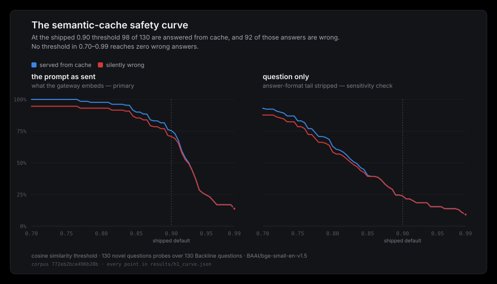

# Phase 8 — results

Three pre-registered experiments, adjudicated against
[`experiments/PRE_REGISTRATION.md`](../PRE_REGISTRATION.md), which was committed at
`aa134f4` before any of this data existed.

**Status: all three closed.**

| | verdict | cost |
|---|---|---|
| **H1** — the semantic-cache safety curve | **no safe threshold exists on this corpus.** τ₀ does not exist; the wrong answers reach a similarity of **0.9995** while legitimate ones go down to **0.890**, so no single number separates them. BUILD_PLAN §P8.H1's second branch | **≈ $0.53–0.57** |
| **H2** — the suite through the gateway | **parity HOLDS at Δ +0.4 against a bound of 3.0.** Passthrough overhead p50 **0.0612 ms**; caching provably off on 462/462 rows; the two meters agree **exactly** on suite traffic. Backline's strict gate failed — and so did the reference run, on disjoint categories | **$7.541253** |
| **H3** — failover under load | **two clauses hold; the third's aggregate bound is exceeded by 0.09 s and the mechanism under it holds exactly** | $0.00 |

Everything below is recomputed from committed artifacts by
`tests/test_experiments_h1.py`, `…_h2.py` and `…_h3.py` on every pull request. A number
here that no longer follows from its input turns the suite red.

---

# H1 — the semantic-cache safety curve

> everyone ships semantic caching; almost nobody measures how often it silently returns the
> wrong answer, because measuring that requires a large question set with exact ground
> truth. Backline is one. — BUILD_PLAN §P8.H1

## The finding

**On 130 Backline questions with exact ground truth, a semantic cache at the industry-default
0.90 threshold answers 75% of never-before-seen questions from a neighbouring entry, and 94%
of those answers are provably wrong** — while, on the same corpus at the same threshold,
correctly serving **99.7%** of genuine paraphrases. Both halves are the finding. A control
surface that looks excellent on the traffic you tested it with and poisons the traffic you
did not is not a safe control surface; it is a trap with a good demo.

**τ₀, the pre-registered recommended threshold, does not exist.** The rule was fixed before
the curve (H-063): the lowest grid point whose silent-wrong-answer count over Family A ∪
Family B is zero and stays zero above it. No grid point in `[0.700, 0.990]` qualifies, in
either embedding space. That is BUILD_PLAN's own second branch, quoted from the plan and
binding as written:

> If the curve has no usable knee (poison appears before meaningful savings), the finding is
> "semantic caching is unsafe for this workload class, here's the threshold-by-threshold
> proof."

Here is the threshold-by-threshold proof — and, now that the paid half has landed, the
reason a higher threshold cannot buy its way out.

## Why no threshold works, in two numbers

| | prompt (primary) | body only (secondary) |
|---|---:|---:|
| highest similarity at which the cache serves a **provably wrong** answer | **0.999539** | 0.998554 |
| lowest similarity at which the cache serves a **correct** answer | **0.889850** | 0.788881 |
| do the two bands overlap? | **yes, across 0.890–0.9995** | yes, across 0.789–0.9986 |

A threshold is a single number and these are two overlapping distributions. Set it above
0.9995 and every legitimate hit is gone too; set it anywhere a paraphrase can still land and
the worst wrong answer lands with it. **The overlap is the result.** τ₀'s non-existence is
not an artefact of a coarse grid — it is this.

## The two families

Pre-registered in §H1.4, both reported, neither substituted for the other.

| | family | probes | is there a right answer to find? |
|---|---|---:|---|
| **A** | **paraphrase** — each probe is a paraphrase of exactly one seeded question | 390 | **yes**, its own question is in the cache |
| **B** | **novel question** — each canonical question probed against a cache holding the other 129 | 130 | **no**, every hit is a wrong-source hit by construction |

**Family A — the favourable case, and the savings side.** Prompt space:

| threshold | hits | correct | **silently wrong** | miss | modelled saving |
|---:|---:|---:|---:|---:|---:|
| 0.70 | 390 | 383 | **7** | 0 | $23.13 |
| 0.85 | 390 | 383 | **7** | 0 | $23.13 |
| **0.90** (shipped default) | **389** | **382** | **7** | 1 | $23.07 |
| 0.95 | 360 | 353 | **7** | 30 | $21.35 |
| 0.99 | 36 | 36 | **0** | 354 | $2.13 |

Seven of 390 paraphrases are answered from the wrong question **even though their own
question is sitting in the cache** — the nearest neighbour was a different question. Those
seven survive every threshold up to 0.95 and only vanish at 0.99, by which point 91% of the
savings have gone with them.

**Family B — the unfavourable case, and the floor the primary sits on.** Prompt space:

| threshold | hits | **silently wrong** | benign collision | miss | modelled saving |
|---:|---:|---:|---:|---:|---:|
| 0.70 | 130 | **123** | 7 | 0 | $7.71 |
| 0.80 | 127 | **121** | 6 | 3 | $7.53 |
| 0.85 | 117 | **111** | 6 | 13 | $6.94 |
| **0.90** (shipped default) | **98** | **92** | 6 | 32 | $5.81 |
| 0.95 | 32 | **32** | 0 | 98 | $1.90 |
| 0.99 | 18 | **18** | 0 | 112 | $1.07 |

**A ∪ B — what the pre-registered rule is computed over:**

| threshold | probes | hits | correct | **SWA** | SWA / probes | SWA / hits | saving |
|---:|---:|---:|---:|---:|---:|---:|---:|
| 0.70 | 520 | 520 | 383 | **130** | 25.0% | 25.0% | $30.84 |
| 0.85 | 520 | 507 | 383 | **118** | 22.7% | 23.3% | $30.07 |
| **0.90** | 520 | 487 | 382 | **99** | **19.0%** | **20.3%** | $28.88 |
| 0.95 | 520 | 392 | 353 | **39** | 7.5% | 10.0% | $23.25 |
| 0.99 | 520 | 54 | 36 | **18** | 3.5% | 33.3% | $3.20 |

`τ₀ = None`. Modelled saving is `hits × $0.0593`, Backline's measured $/query including
judge, fixed in the pre-registration before any of this existed.



Every point of both curves, both spaces, is in [`h1_curve.json`](h1_curve.json); every
probe's top-3 neighbours and its classification are in [`h1_probes.json`](h1_probes.json).

## Why — the mechanism, not a mystery

The highest similarity at which the cache serves a provably wrong answer is **0.999539**.
That pair is:

```
asked   Scan every statement for period 2026-02 for reporting anomalies — duplicates,
        unknown ISRCs, currency mismatches, negative units, period bleed, suspicious
        territory spikes, and dashboard divergence. …
served  Scan every statement for period 2026-04 for reporting anomalies — duplicates,
        unknown ISRCs, currency mismatches, negative units, period bleed, suspicious
        territory spikes, and dashboard divergence. …

the caller receives   5 findings, on line ids 80023526, 89000001-4
the true answer is    2 findings, on line ids 100013815, 109000001
```

Two questions differing in **one period token**. The embedding is not broken; it is right.
Those two prompts really are 99.95% the same text, and a similarity model that said otherwise
would be the defective one. **The failure is in using that measurement as an admission
decision**, because the seven characters it correctly treats as negligible are the entire
answer.

The corpus makes the point at the other end too. Across all 520 probes the *lowest* top-1
similarity to anything in the cache is **0.766012** — so at the pre-registered grid's floor of
0.700, every probe hits something, and the whole range of nearest-neighbour similarity in this
workload is **0.766 → 0.9995**. Entity-substituted templated questions are maximally similar
in form and maximally different in answer; a single cosine threshold has no room to work in.

That is not a property of Backline. It is a property of **every application that templates
its prompts**, which is most of them.

## The boilerplate effect, which is why H-060 was pre-registered

Stripping the shared answer-format tail drops the combined 0.90 hit rate from **93.7% to
72.5%** and the silent-wrong-answer count from **99 to 38**. The eight instruction tails
shared across 130 questions raise the floor under every pairwise similarity — and they raise
it most between questions that share an answer *type*, which is to say between the
near-misses.

Reporting only the tail-stripped curve would have understated the danger by a factor of
2.6. Naming which curve was primary **before** either existed is the reason that is a finding
here rather than an argument. The primary is the prompt as `Dialect.cache_probe` actually
embeds it, because that is the only text whose numbers describe a cache anyone could deploy.

## Per category, at the shipped 0.90 default

All 520 probes, both families, counted at 0.90 (§H1's `by_category`, which is descriptive
and was pre-registered as secondary — never as a place to go looking for a subset):

| category | probes | miss | correct | benign | **silently wrong** | SWA rate | closest wrong neighbour |
|---|---:|---:|---:|---:|---:|---:|---:|
| reconciliation | 60 | 0 | 39 | 0 | **21** | **35.0%** | **0.9995** |
| royalty_math | 100 | 2 | 75 | 1 | **22** | 22.0% | 0.9533 |
| contract_terms | 80 | 3 | 59 | 2 | **16** | 20.0% | 0.9752 |
| recoupment_state | 60 | 0 | 45 | 3 | **12** | 20.0% | 0.9602 |
| catalog_lookup | 60 | 5 | 45 | 0 | **10** | 16.7% | 0.9956 |
| cross_collateral | 32 | 2 | 24 | 0 | **6** | 18.8% | 0.9106 |
| multi_step | 48 | 7 | 35 | 0 | **6** | 12.5% | 0.9926 |
| abstention | 40 | 6 | 30 | 0 | **4** | 10.0% | 0.9337 |
| sql_analytics | 40 | 8 | 30 | 0 | **2** | 5.0% | 0.9489 |

Every category is poisoned. `sql_analytics` fares best because its questions name distinct
statement ids in prose; `reconciliation` fares worst — the highest poison rate *and* the
closest wrong neighbour in the corpus — because its questions are one template with a date in
it.

## The corpus, and the human clause of its QA chain

130 questions, 390 paraphrase probes, corpus hash `7a983e81…`, suite `6eef41c6706f309a`,
rubric version 2 (`f7a48a69…`), embeddings `BAAI/bge-small-en-v1.5` on CPU.

**Three of Backline's 133 questions are excluded**, mechanically and for an intrinsic
reason: the prompt-injection canaries carry no T1 answer key, so they cannot be seeded from
ground truth and have no defined equivalence (amendment A1, committed before the corpus).

**The operator's spot-check is a gate, and it fired twice.** Twenty probes drawn by a seeded
RNG (seed `20260810`), read against the rubric, across **three review rounds**; approval is
recorded in the corpus artifact's provenance block (`Sergio Avila (operator)`,
`2026-08-10T23:29:38Z`) and the sweep does not run without it. Both catches were *systematic*
failures that every mechanical check of the day passed:

| round | what the human saw | what it turned out to be | fix |
|---|---|---|---|
| 1 | `contract_terms-004#p3` asked for a citation but dropped the rate | **25 collapsed candidates across 17 questions** — a two-part ask silently compressed to one | the compound-ask check (H-069), then `RUBRIC_VERSION = 2` when redraws thrashed (H-070) |
| 2 | `reconciliation-006#p1` turned `Do not submit a batch.` into an instruction to submit individually | **13 inverted or dropped prohibitions across 7 questions** — the whole reconciliation family | the prohibition check (H-071) |

Both were caught **before any measurement existed**, which is risk-register item 3 working as
designed: a bad batch is regenerated before the sweep, never after. Neither audit was
reachable from the sampled twenty — in round 2 the forced redraw came back with a clean
`#p1` and *the identical inversion in `#p3`*, so re-reading the same sampled ids would have
passed it. The mechanical checks found the other twelve.

## What this measures, and what it does not

- **It measures the cache, not the model** (H-059). Every seeded entry is ground truth from
  Backline's answer key, so a wrong answer here is the cache resolving to the wrong question
  and nothing else. A real cache also holds the model's own errors; Backline has published
  that rate separately — **93.7 through the gateway, this phase, §H2** — and the two compose.
- **A right answer for the wrong reason is not counted as correct** (H-061). Six of the 487
  hits at 0.90 are *benign collisions* — a different question whose answer happens to be
  equivalent under Backline's own scorer, mostly abstentions sharing the `ABSTAIN` token.
  They are in their own column and never folded into "correct".
- **Family A cannot rescue the verdict and was never going to.** Adding probes can only add
  SWA to a grid point, so "no τ₀" was decided by Family B alone before the paid step. What
  the $0.53 bought is the *other* axis: the trade-off, and the two-number overlap above.
- **The admission decision is the shipped one**, replayed offline: cosine over one namespace,
  identical `context_hash` and `embedding_model`, `similarity >= threshold`, top-1, ties by
  ascending id. A k > 1 analysis would measure a gateway nobody runs.

## What a reader should take from it

Not "never use a semantic cache". The honest reading is narrower and more useful:

**A cosine threshold is the wrong control surface for a workload whose questions differ by an
entity or a period.** The similarity of a dangerous near-miss (0.9995) sits *above* the
similarity of many legitimate paraphrases (down to 0.890), so no single number separates
them. What would work is not a higher threshold but a different mechanism — requiring the
extracted entities and periods to match exactly before a semantic hit is allowed, which is a
filter rather than a bar. Headroom does not ship that today, and this measurement is why it
is the first thing its cache should grow.

Meanwhile the shipped default of `0.90` is documented as measured on 12 questions and
expected to move. It has now moved: on 130 questions with ground truth, **0.90 is not safe
for this workload class, and neither is any other value in the range.**

---

# H2 — gateway overhead and the third parity treatment

Backline's full 133-question `core` suite, run through Headroom by pointing
`ANTHROPIC_BASE_URL` at the gateway and nothing else. **Zero changes to Backline**, its
scoring included.

| | |
|---|---|
| run | `21369386-a040-4589-90a1-0e75409711ec`, 2026-08-10 |
| suite / judge | `6eef41c6706f309a` · `claude-sonnet-5`, rubric `ffe8c9753172` |
| scored | **133 / 133**, `n_skipped_budget` 0, infra errors **0**, **no heal pass** |
| spend | **$7.540398** of the $12.00 stop (Backline's own committed-spend gate) |
| ledger | **462 rows**, all `outcome = ok` |

## Score parity — the pre-registered primary, and the only parity instrument

> **Primary:** the through-gateway overall score satisfies **|overall − 93.3| ≤ 3.0**.
> — §H2.2

| | overall | Δ vs gateway |
|---|---:|---:|
| **gateway (this run)** | **93.7** | — |
| direct-local `a309dc57` — **the pre-registered comparator** | 93.3 | **+0.4** |
| AWS `93731060` | 92.5 | +1.2 |
| committed sweep `62865d3c` | 91.6 | +2.1 |

**Verdict: WITHIN NOISE. Δ = +0.4 against a bound of 3.0** — 13% of the allowance, and in the
gateway's favour. The exact means are 93.6968 and 93.2959; both are reported to one
decimal because that is the figure `evals report` prints and the one the pre-registration
named.

Per category, against all three references:

| category | n | baseline | direct-local | **gateway** | AWS | sweep | gwy − direct |
|---|---:|---:|---:|---:|---:|---:|---:|
| catalog_lookup | 15 | 100.0 | 100.0 | **100.0** | 100.0 | 100.0 | 0.0 |
| royalty_math | 25 | 100.0 | 100.0 | **100.0** | 100.0 | 100.0 | 0.0 |
| recoupment_state | 15 | 100.0 | 100.0 | **100.0** | 100.0 | 100.0 | 0.0 |
| cross_collateral | 8 | 100.0 | 100.0 | **100.0** | 100.0 | 100.0 | 0.0 |
| sql_analytics | 10 | 100.0 | 100.0 | **100.0** | 100.0 | 100.0 | 0.0 |
| adversarial | 3 | 93.3 | 100.0 | **100.0** | 100.0 | 100.0 | 0.0 |
| abstention | 10 | 100.0 | 90.0 | **100.0** | 100.0 | 90.0 | **+10.0** |
| reconciliation | 15 | 96.7 | 98.3 | **98.3** | 86.7 | 83.3 | 0.0 |
| multi_step | 12 | 72.8 | 65.0 | **71.1** | 72.2 | 67.8 | **+6.1** |
| contract_terms | 20 | 85.0 | 82.7 | **76.7** | 77.0 | 81.0 | **−6.0** |
| **overall** | **133** | **94.8** | **93.3** | **93.7** | **92.5** | **91.6** | **+0.4** |
| $/query incl. judge | | | $0.0593 | **$0.0567** | $0.0602 | $0.0609 | |
| latency p50 | | | 12,678 ms | **12,185 ms** | 12,508 ms | 13,033 ms | −493 ms |
| latency p95 | | | 65,855 ms | **63,139 ms** | 71,122 ms | 75,870 ms | −2,716 ms |
| T2 violations | | | 2 | **3** | 7 | 3 | |
| infra errors | | | 0 | **0** | 0 | 0 | |

**The limitation, stated before the result and unchanged by it:** there is **no same-day
paired control**. §A5.5 defines parity as a paired fresh-control-vs-fresh-treatment
comparison; a control run would cost another ~$8 against a $10 line. So between-day drift
sits inside this residual and cannot be separated from the gateway's effect. The claim H2
supports is about a **bound**, not an effect size — which is exactly why the latency and
$/query rows above, where the gateway run happens to lead on every measure, are reported as
*context* and not as a result. A gateway does not make a model faster.

## Overhead — three numbers, because one would be misleading

**Primary (the plan's, and H-051's column): `passthrough_overhead_ms`, first upstream byte →
first byte out, over all 462 `ok` rows.**

| p50 | p95 | p99 | max | target | verdict |
|---:|---:|---:|---:|---:|---|
| **0.0612 ms** | 0.1176 ms | 0.1644 ms | 0.8231 ms | p50 < 50 ms | **HOLDS** |

Stated in the pre-registration rather than discovered here: **this is a weak test and passing
it by three orders of magnitude proves little.** P1 measured 0.006 ms and P6 0.019 ms against
the mock; a 50 ms target was never going to be threatened. It is reported first because it
is the metric that was promised, and it is reported with that sentence attached.

**Secondary A — admission cost, keyless, $0.00, and the honest number.** The ledger cannot
separate gateway work from provider time — `upstream_latency_ms` contains both, with no mark
between them — so admission is measured where the provider costs nothing. 2,000 requests
through the full pipeline (auth, routing, rate limiter, cache, budget gate):

| configuration | p50 | p95 | p99 |
|---|---:|---:|---:|
| in-memory stores | **0.207 ms** | 0.329 ms | 0.477 ms |
| DynamoDB Local behind the limiter and the budget gate | **1.441 ms** | 2.288 ms | 4.633 ms |
| **what the two atomic conditional writes cost** | **1.233 ms** | 1.959 ms | — |

Against this run's own measured **12,185 ms** p50 per question, the gateway's admission path
is **0.012%** of a request. The two DynamoDB conditional writes that make the budget gate and
the rate limiter unraceable — the thing Phases 4 and 4b are about — cost **1.2 ms**, and this
is the first time this repo has priced them. Caveat recorded with the number: it excludes TLS
and DNS setup to a real upstream, which httpx amortises over a keep-alive pool and which a
direct caller pays too. Data: [`h2_bench.json`](h2_bench.json).

**Secondary B — caller-visible latency.** In the parity table above, with the loudest caveat
in this document attached: latency across days and model load is far noisier than the score,
there is no paired control, and the gateway leading on p50 and p95 is a draw, not an effect.

## The cache-disabled proof (H-047) — a count, and it is zero

| disposition | rows |
|---|---:|
| `cache_disabled` | **462** |
| anything else | **0** |

**HOLDS.** Pre-registered as the clause that invalidates the run outright: a single cache hit
answers in microseconds without touching a provider, so an overhead figure measured over one
is a hit-rate figure wearing its name. The pre-flight refused to start until
`GET /admin/cache/{tenant}` reported `mode: disabled` ([`h2_preflight.json`](h2_preflight.json)),
and the ledger confirms it row by row after the fact.

## Error accounting

| | |
|---|---|
| `outcome` | `ok` × 462 — nothing else |
| `error_reason` | none |
| `cost_status` | `priced` × 462; **unpriced requests: 0** |
| `failover_hops` | **0** × 462 — the `claude-` route has no chain, by design, and the pre-flight refused otherwise |
| Backline `errors.n` | 0 · quarantined infra errors 0 · `n_skipped_budget` 0 · `budget_exhausted` false |

**No heal pass was used.** §H2.5 allows exactly one, for infra errors, per Backline D-032.
There were none.

## The two-meter cross-check — and it is exact

Pre-registered as falsifiable: two independent meters over one stream of traffic, Headroom
from the usage block it observes in the stream, Backline from the SDK's own.

| | |
|---|---:|
| Headroom's ledger, all 462 rows | **$7.541253** |
| Backline's `total_cost_usd` | **$7.540398** |
| difference | **$0.000855** — inside the pre-registered $0.01 |
| difference **excluding the one non-suite row** | **$0.000000** |

The entire residual is a single identified request. `hr_e171f6024fc64772a66840fda6aab05a` is
the §2c pre-flight tool-block smoke — one `claude-haiku-4-5` call on the same tenant at
23:36:53, five minutes before the suite's first request, which Headroom metered and Backline
never issued. Its id is recorded in `h2_preflight.json`, and it is the only row in the export
not on the run's own model. Set it aside and **the two meters agree to twelve decimal
places on 461 requests**: $7.540398000000 against $7.540398.

**One clause could not be evaluated, and it is a defect in the pre-registration rather than
in the run.** §H2.4 also asks that *"total input and output tokens agree exactly"*. Backline
publishes `total_cost_usd` and **no token totals** — not in `summary.json`, not in
`results.jsonl` — so there is nothing to compare Headroom's 2,863,154 input and 181,580
output tokens against. Reported as `NOT EVALUABLE`, not quietly dropped. The related premise
*is* checkable and checks out: `cache_read_tokens` and `cache_write_tokens` are **0 across
all 462 rows**, so Backline used no prompt caching and H-026's `partial` caveat cannot arise.

## Backline's strict regression gate FAILED — and so did the reference run

Run and reported per §A5.5, whose known failure modes §H2.2 pre-declared: *"a legitimate
fresh run can fail it on variance alone (T2 flicker, small-n category swing)."*

**The gateway run, verbatim:**

```
gate: FAIL
  ✗ contract_terms: 76.7 vs baseline 85.0 (-8.3 pts > 3)
  ✗ 3 T2 violation(s) — process assertions failed
  · adversarial: improved 93.3 → 100.0
  · reconciliation: improved 96.7 → 98.3
```

**The direct-local reference run `a309dc57` — the same run whose 93.3 is H2's comparator —
against the same baseline:**

```
gate: FAIL
  ✗ abstention: 90.0 vs baseline 100.0 (-10.0 pts > 3)
  ✗ multi_step: 65.0 vs baseline 72.8 (-7.8 pts > 3)
  ✗ 2 T2 violation(s) — process assertions failed
  · adversarial: improved 93.3 → 100.0
  · reconciliation: improved 96.7 → 98.3
```

So does the committed sweep row `62865d3c` (four category drops, 3 T2 violations), and so did
the AWS run (`contract_terms` 77.0, `reconciliation` 86.7, 7 T2 violations). **No full-suite
`claude-sonnet-5` run in Backline's recorded history has ever passed this gate**, including
the two that produced the numbers this experiment compares against.

### First: which instrument does H2's parity claim actually pre-register?

The Δ bound. §H2.2 makes the overall-score comparison against the direct-local run the
**primary**, and names `evals gate` as the **secondary**, "on the record with its known
failure modes". They are different instruments and only one of them is the hypothesis.

**With the fixed reader, the primary reads: overall 93.7, Δ +0.4, bound 3.0 → WITHIN NOISE.**
The gate's verdict does not change that and was never scoped to.

That is a distinction worth being suspicious of when it appears *after* a failure, so it is
worth saying plainly what would not have been allowed: swapping the instrument, widening the
bound, dropping the gate from the report, or re-running until it passed. None happened. The
bound, the comparator and the gate's secondary status were fixed in a document committed
before the run, and the gate's output is printed above in full including the line that is
worst for the gateway.

### Second: is the gate's failure the pre-declared variance, or something the gateway did?

Backline's §A5.5 fixed the reading before either run existed:

> A broken environment degrades systematically — same categories, same direction, traceable
> mechanism.

**It does not degrade systematically. It scatters, and it scatters both ways.**

| | direct-local | gateway |
|---|---|---|
| categories failing the gate | `abstention` −10.0, `multi_step` −7.8 | `contract_terms` −8.3 |
| T2 violations | 2 | 3 |
| overall | 93.3 | **93.7** |

The two runs fail on **disjoint categories**. Per question, over all 133: the gateway scored
**higher on 13**, lower on 17, and **identical on 103**. It *improved* `abstention` by 10.0
and `multi_step` by 6.1. A transport that corrupted what the model saw or said would not
hand back a better score on two categories and an identical one on five.

**T1 — the deterministic tier, scored against the answer key with no judge and no agent
trace in it — is identical on 132 of 133 questions.** The one that moved,
`hand-abstention-02`, moved *in the gateway's favour* (0.0 → 1.0). Every category's T1 is
100.0 in both runs except `abstention`, where the gateway is higher. If bytes had been
altered in flight, this is the row where it would show, and it does not.

### `contract_terms`, decomposed

Direct-local 82.67 → gateway 76.67, a 6.00-point drop. It does not all belong to this run:

- **The dip partly pre-exists.** The direct-local reference is *already* 2.33 below the 85.0
  baseline. Across every full `claude-sonnet-5` run on this suite the category has scored
  **76.67 / 77.0 / 81.0 / 82.67 / 85.0** — an **8.33-point same-model spread, larger than the
  gate's entire 3.0 tolerance**. The AWS run, a different environment with no Headroom in it
  anywhere, scored **77.0**, which is 0.33 points from this one.
- **The committed baseline is a composite.** Its own `note` says it is assembled per category
  from three different runs — a best-of envelope that no single run has ever reproduced. Its
  overall, 94.8, is a full point above the best run in the history.
- **56% of the drop is one question.** `contract_terms-016` went 0.667 → 0.000, which is
  −3.33 of the −6.00 category points on its own. A question scores `min(tier scores)`
  (`evals/runner.py`), so its failed T2 zeroed it outright.
- **The remaining −2.67 is judge variance**, spread over 19 questions whose T1 *and* T2 are
  100/100 in both runs: 12 down, 4 up, 4 unchanged. That is the LLM-judged prose tier doing
  what an LLM-judged prose tier does.

### The one violation that is unique to the gateway run, named rather than explained away

Two of the gateway's three T2 violations are the **identical failure mode** as both of the
direct run's: `sql_clean` tripping on the same `information_schema` denial string, in the
same two categories, on different question ids —

| | direct-local | gateway |
|---|---|---|
| `sql_clean` on a `multi_step` question | `multi_step-001` | `multi_step-004` |
| `sql_clean` on a `reconciliation` question | `reconciliation-009` | `reconciliation-012` |
| **`cites_clause`** | — | **`contract_terms-016`** |

That is textbook T2 flicker: the agent probes `information_schema` on *some* question in each
of those categories, and which one it lands on wanders run to run. The historical range
across full runs is **2–8**; both of these sit at the bottom of it.

**The third is real, is only in the gateway run, and is the pre-declared checker false
positive** — §A5.5 names that adjudication precedent explicitly ("the benchmark's T2 miss
adjudicated as a checker false positive"). The mechanism is mechanical and checkable:

```
_CITATION = re.compile(r"FBR-[CA]-\d{5}\s+§[A-Z0-9]+")      backline/agents/configs.py
```

The contract code and the section marker must be **adjacent**. Both runs cite the same
governing clause of the same contract and both get the same right answer:

| | direct-local | gateway |
|---|---|---|
| how the clause is written | `…worldwide physical rate: "8%…" (FBR-C-00777 §3(a5))` | `…under the governing base agreement FBR-C-00777 (effective 2025-07-09→), §3(a5): "8%…"` |
| citations extracted | `["FBR-C-00777 §3"]` | `[]` |
| **T1 (answer key)** | **1.0 — `8%`** | **1.0 — `8%`** |
| T3 (judge) | 0.667 | 0.467 |
| question score | 0.667 | **0.000** |
| answer length | 1,047 chars | 1,278 chars |

The gateway's answer interposes a parenthetical between the contract code and the section
marker. Delete those 25 characters and the identical answer extracts
`FBR-C-00777 §3` and passes. The answer is not truncated, not malformed, and is *longer* than
the direct one — it also ran the escalator calculation the direct answer declined to run.

The miss then cascaded: with zero citations, `fetch_cited_clauses` had no clause text to hand
the judge, and the T3 rationale says so in as many words — *"no cited clause text was actually
provided to verify any of this"* — dropping T3 on that question from 0.667 to 0.467 as well.

**This is recorded as a checker false positive under §A5.5's own precedent, and it is named
here in full so a reader can disagree with that call using the same evidence.** The raw
recorded check detail for both runs is in
[`h2_gate_adjudication.json`](h2_gate_adjudication.json) under
`per_question.t2_violations.treatment_only_evidence`. What it is *not* is evidence about the
transport: an answer that names its clause differently is a model draw, and the byte-level
question is settled elsewhere and directly.

### The transport evidence, which belongs here either way

Whatever one concludes about `contract_terms-016`, the question "did the gateway alter the
traffic" has its own answers and they are not scores:

- **462 / 462 rows `outcome = ok`**, zero errors, zero failover hops, zero unpriced requests.
- **Caching provably off on every row** — the count that would have invalidated the run is 0.
- **Passthrough overhead p50 0.0612 ms**: the gateway is not buffering, rewriting or waiting.
- **The two meters agree to twelve decimal places** on the 461 suite requests. A transport
  that dropped, truncated or duplicated content would not produce identical token accounting.
- **No truncation, checked directly**: the gateway run's answers total 117,927 characters
  against the direct run's 116,473 — *longer*, and truncation makes text shorter — with zero
  empty answers and **116 of 133 carrying a terminal `ANSWER:` line in both runs**, the other
  17 being the reconciliation and abstention protocols that do not use one.
- **Byte fidelity is a keyless test, not an inference**:
  `test_a_tool_use_reply_reaches_the_client_byte_for_byte`,
  `test_a_tool_result_follow_up_reaches_the_provider_byte_for_byte`, and
  `test_escaped_unicode_survives_exactly_as_written` have gated every PR since Phase 1, and
  the §2c smoke re-verified the tool path against the real API through this exact hop before
  the $8 run started.
- **T1 identical on 132 of 133**, the exception favouring the gateway.

**Verdict on the gate: the failure is variance per Backline §A5.5's pre-declared failure
modes** — two fresh runs failing the same strict gate in disjoint places, against a composite
baseline no run has matched, with one named checker false positive inside it. Nothing was
re-run, re-rolled or healed (§H2.5). The gate exits non-zero and that is published as found.

---

# H3 — failover under load

Adjudicated from evidence that already existed (H-067): the chaos suite CI has run since
Phase 6, and the 492 ledger rows the operator's 2026-08-10 two-GPU kill left in the compose
volume. **No new GPU session was required**; what was missing was never a picture but the
numbers behind one.

## Clause 1 — zero caller-visible 5xx for pre-first-token faults

**HOLDS, on both halves.**

*The mock chain*, three deterministic fault intensities cycling 529 / 429 / 500 / timeout /
connect-error through a two-provider chain:

| intensity | requests | faults | statuses | caller-visible 5xx | hops | primary breaker |
|---|---:|---:|---|---:|---:|---|
| light (25%) | 20 | 5 | all 200 | **0** | 5 | closed |
| heavy (50%) | 20 | 10 | all 200 | **0** | 18 | open |
| brutal (100%) | 20 | 20 | all 200 | **0** | 20 | open |

*The two-GPU kill*: **270 requests** on the `vllm_a → vllm_b` chain over **77 minutes**, one
every 4.65 s, across **two** kill-and-restore cycles. Every one returned **200**. 129 served
by the primary, 141 by the fallback — 58 after a real connection refusal, 82 skipped by an
open breaker, one after a timeout.

**Zero caller-visible errors while a GPU was dead, twice.**

## Clause 2 — recovery within a stated bound

**The pre-registered aggregate bound is exceeded on 2 of 39 probe gaps, by at most 0.09 s.
The mechanism it was a proxy for holds exactly, 37/37.** Both are published; neither was
adjusted.

The bound was arithmetic from H-052's published constants (§H3.2): re-admission happens on
the first request arriving more than `COOLDOWN_S = 10 s` after the last attempt, so under a
load of one request every `T` seconds it is observed within `10 + T`. With the median load
interval of 4.65 s that is **14.65 s**. Observed: median **14.07 s**, maximum **14.74 s** —
two gaps over, by 0.09 s and 0.02 s.

The diagnosis is in the data. The premise "one request every T seconds" idealises a loop
whose intervals actually spanned **4.01 s to 19.99 s**; a 4.74 s gap presenting after the
cooldown produces a 14.74 s probe gap and the breaker did nothing wrong. Checked directly,
without any aggregate: **every one of the 37 probes was the first request to arrive at or
after the previous attempt plus the cooldown.**

The cooldown is visible in the raw data, which is the part worth seeing. Once the breaker
trips, only the half-open probe reaches the dead provider, so the spacing between real
attempts *is* the cadence:

```
before the breaker trips   4.7  4.8  4.7  4.6  4.8  4.8  4.6  4.7   (the load's own interval)
after it trips            14.1 14.1 14.1 14.2 14.3 14.3 14.2 14.1   (cooldown + one interval)
```

| outage | duration | requests | real attempts | skipped by the breaker | back on the primary after |
|---|---:|---:|---:|---:|---:|
| 06:19:55 → 06:25:34 | 339 s | 72 | 30 | 42 | **4.8 s** |
| 07:24:01 → 07:30:21 | 380 s | 69 | 29 | 40 | **4.65 s** |

Both recoveries took exactly one load interval after the last hop: one probe went through,
succeeded, closed the breaker, and the next request was served by `vllm_a` again.

## Clause 3 — mid-stream faults surface as terminal error events, 100%

**HOLDS.** Four cut points, including one *after* the last text delta where the fragment
reads as a finished answer and only the missing terminal marker gives it away:

| cut after | terminal `error` event | `message_stop` present | fallback spliced in |
|---:|---|---|---|
| 1 chunk | yes | no | no |
| 4 chunks | yes | no | no |
| 8 chunks | yes | no | no |
| 12 chunks | yes | no | no |

**0 silent truncations, 0 splices.** §P8.H3's falsification condition is *any* silent
truncation reaching a caller; none did.

The live half cannot check this — a ledger records that a stream was cut, not what frames the
caller saw — and the analysis says so rather than claiming it. There were no mid-stream cuts
on the vLLM chain in this window anyway; the six in the same ledger belong to `make seed`'s
mock traffic and are counted separately.

Data: [`h3_chaos.json`](h3_chaos.json), [`h3_livekill.json`](h3_livekill.json), and the raw
rows at `docs/evidence/p8-experiments/h3-livekill-ledger-rows.json`.

---

## Spend

Every dollar in this phase was spent by the operator, from `experiments/RUNBOOK.md`, with the
cost stated before the command. Claude Code ran nothing that costs money (§0.2 invariant 2's
discipline, applied to spend).

### H1 — paraphrase generation, the whole rubric v1 → v2 saga

Recovered from the `spend` block of every committed state of `h1_paraphrases.json`. The block
records **one invocation**, so the record is per commit, not cumulative:

| commit | rubric | USD | calls | what it bought |
|---|---|---:|---:|---|
| `696fec9` | v1 | 0.189785 | 163 | the first full run — 114/130, 16 blocked by the H-068 checker bug |
| `f5de1d7` | v1 | 0.019801 | 15 | the 16, after H-068 corrected the entity extractor → 130/130 |
| `71afa0e` | v1 | 0.001111 | 1 | `contract_terms-004`, the operator's **first** spot-check rejection |
| `d3d28a3` | v1 | 0.015973 | 15 | the **last** of three compound-ask redraw rounds (17 → 8 → 5 → 5) |
| `0f1556d` | v2 | 0.190212 | 147 | the full regeneration under `RUBRIC_VERSION = 2` (H-070) |
| `7d75d41` | v2 | 0.002596 | 2 | v2 completion → 130/130, 0 unresolved |
| `bd17191` | v2 | 0.001797 | 1 | `reconciliation-006`, the operator's **second** spot-check rejection |
| `e902902` | v2 | 0.022395 | 13 | the 7 negation-family redraws under H-071 |
| **evidenced total** | | **$0.443670** | **357** | |

**Two rounds are missing from that table and are estimated, not evidenced.** The first two
compound-ask redraw rounds (17 ids, then 8) were overwritten by the third before anything was
committed — rejected drafts are never persisted, which is the right behaviour and costs this
receipt. At the run's own mean of $0.001243/call and ≥ 75 calls, they are **$0.09–0.13**; the
contemporaneous PHASE_LOG estimate for all three rounds was ~$0.11.

> **H1 total: ≈ $0.53–0.57**, of which **$0.443670 is evidenced** and ~$0.09–0.13 is
> reconstructed. Against §0.6's **$1.00** line for H1 paraphrase generation.

The saga cost roughly $0.21 more than a clean single pass would have — two checker
amendments, one rubric bump, and two operator rejections. That is what the QA chain cost,
against a defect rate it caught of 25 collapsed asks and 13 inverted prohibitions in 390
probes.

### H2 — the suite through the gateway

| | budgeted | actual |
|---|---:|---:|
| §2c pre-flight tool-block smoke | ~$0.02 | **$0.000855** |
| the suite run `21369386` | ~$8.09, stop $12.00 | **$7.540398** |
| **H2 total (Headroom's ledger, 462 rows)** | | **$7.541253** |

The $12.00 stop was never approached; the $15.00 Headroom backstop never fired, which is what
a backstop set above the operative stop is supposed to do (H-066).

### The phase, and the project

| bucket | §0.6 cap | spent | left |
|---|---:|---:|---:|
| P8.H1 paraphrase generation | $1.00 | ≈ $0.53–0.57 | ≈ $0.43–0.47 |
| P8.H2 suite through the gateway | $10.00 | $7.541253 | $2.46 |
| P8 contingency / heal passes | $6.00 | **$0.00** | $6.00 |
| P8.H3 | — | **$0.00** | — |
| **Phase 8** | **$17.00** | **≈ $8.07–8.11** | ≈ $8.89 |
| P0–P7 live smokes | $3.00 | < $0.01 | ~$3.00 |
| **Project, against the $20 hard cap** | **$20.00** | **≈ $8.08–8.12** | **≈ $11.9** |

**No budget amendment was needed, no stop fired, and no cap was raised.** Every experiment
came in under its line, and the phase used **41%** of the project's total live-API cap.
